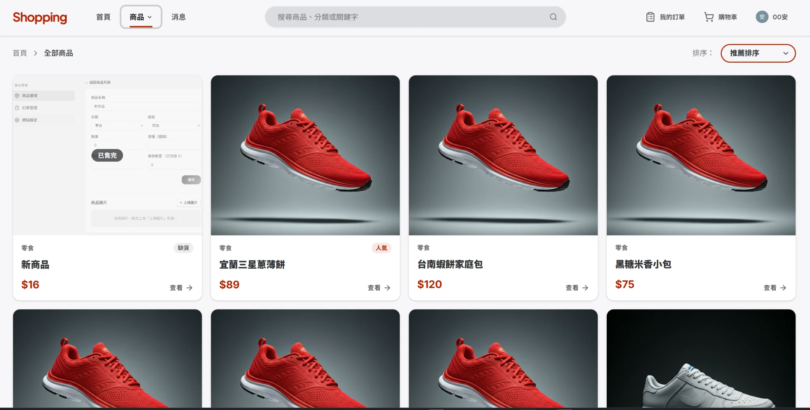
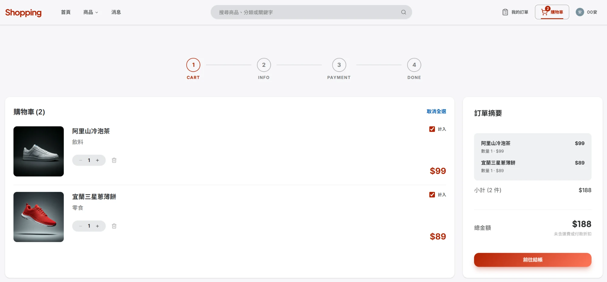
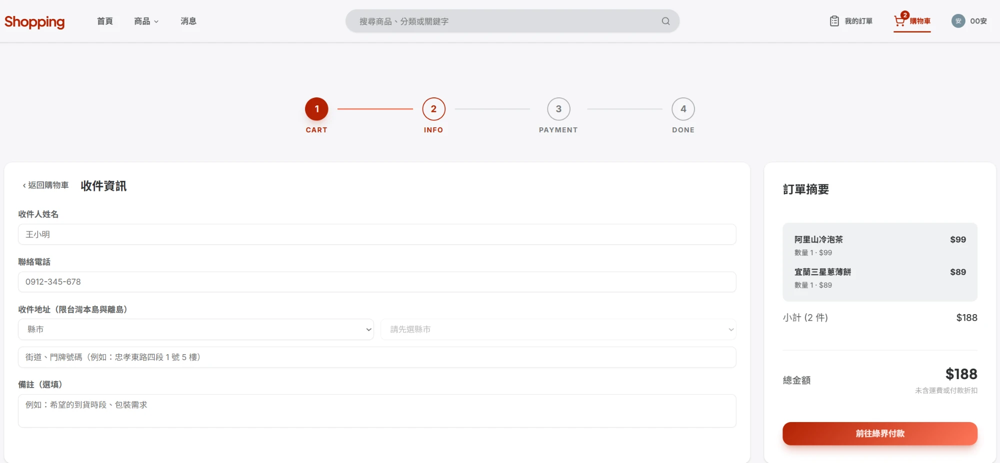
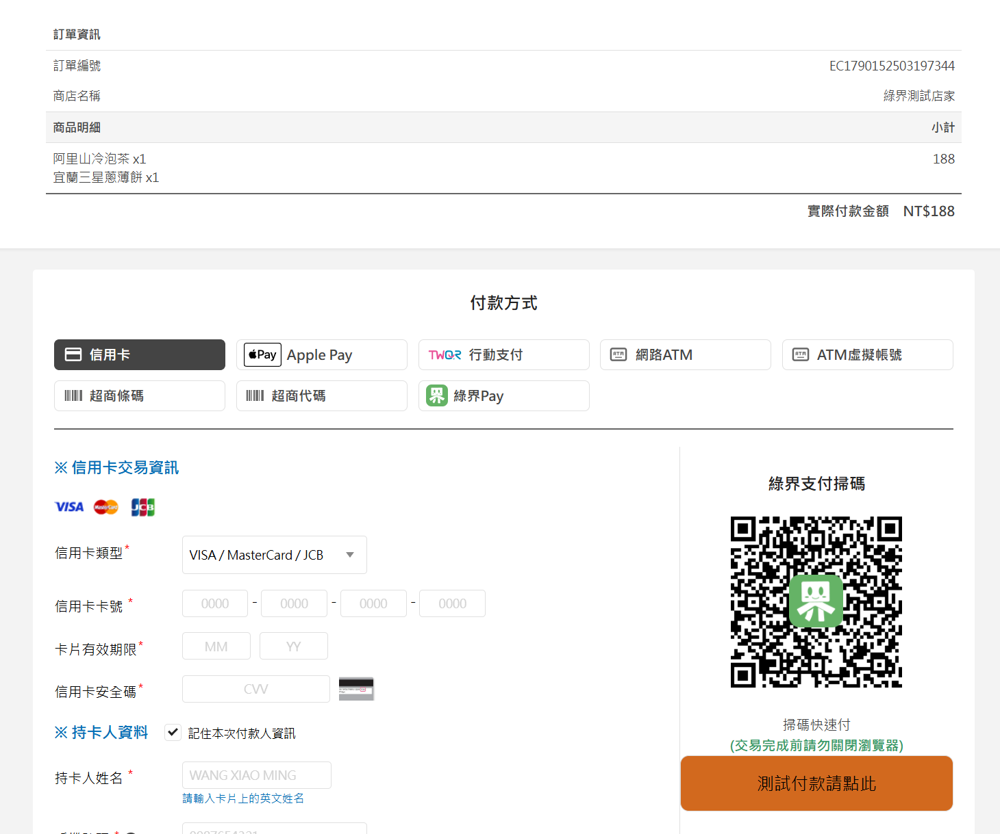
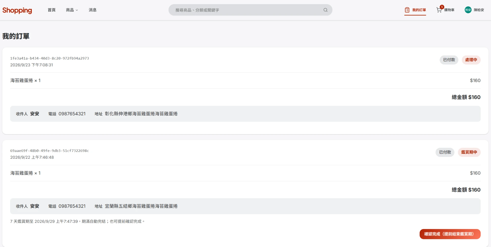
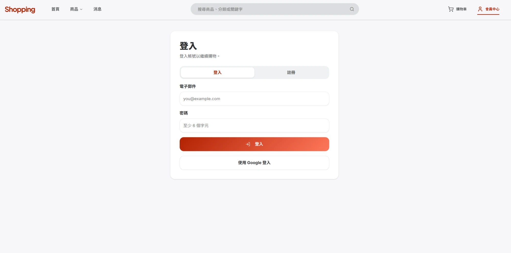
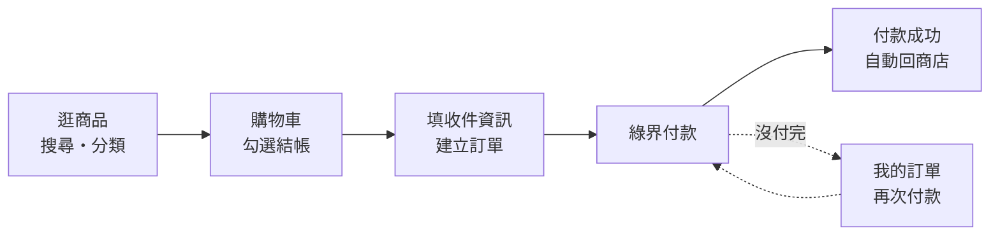
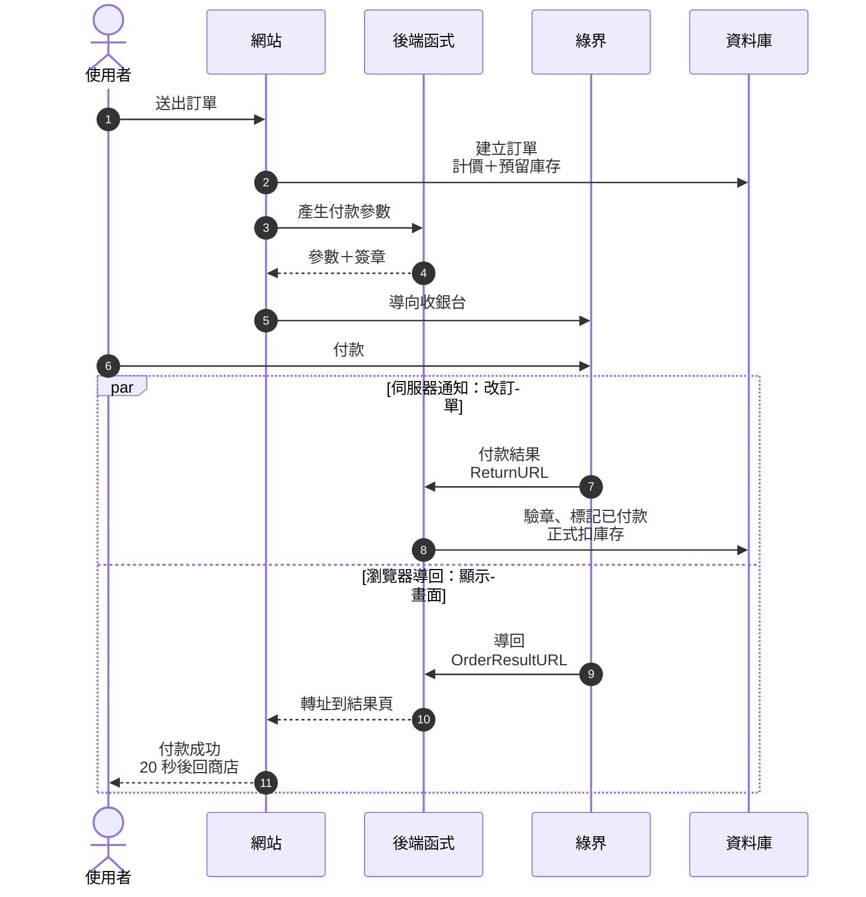
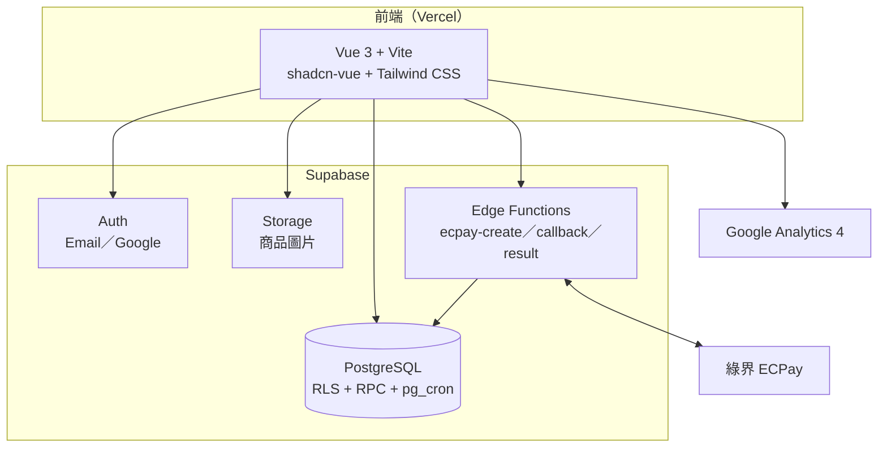

# online_shop 線上購物商店

[](https://github.com/boan-chen047/online_shop/actions/workflows/ci.yml)

以 **Vue 3 + Supabase** 打造的全端電商網站，涵蓋商品瀏覽、搜尋與分類、購物車、**綠界（ECPay）金流結帳**、訂單追蹤與後台管理，並部署在 Vercel。

- **正式站**：https://online-shop-ruby-one.vercel.app
- **原始碼**：https://github.com/boan-chen047/online_shop


---

## 目錄

- [功能總覽](#功能總覽)
- [畫面預覽](#畫面預覽)
- [交易流程（User Journey）](#交易流程user-journey)
- [技術架構](#技術架構)
- [資料庫設計](#資料庫設計)
- [安全設計](#安全設計)
- [專案結構](#專案結構)
- [本機開發](#本機開發)
- [Supabase 設定](#supabase-設定)
- [部署與 CI](#部署與-ci)
- [綠界金流測試方式](#綠界金流測試方式)
- [已知限制與後續規劃](#已知限制與後續規劃)

---

## 功能總覽

### 顧客端

| 功能 | 說明 |
|---|---|
| **首頁** | 主視覺、**限時特賣**（倒數計時、折後價）、**熱銷排行**（依實際已付款訂單的銷量統計） |
| **商品列表** | 依**分類**篩選（零食、飲料、生活用品、電子設備、手錶）、**關鍵字搜尋**（比對商品名稱、分類、描述、標籤）、排序、分頁（每頁 16 件） |
| **商品詳情** | 多張圖片輪播、規格、庫存狀態（缺貨自動停用加入購物車）、限時折扣標示 |
| **購物車** | 登入後存在資料庫，換裝置、重新登入都還在；可勾選部分商品結帳 |
| **結帳** | 收件資訊表單（台灣縣市／鄉鎮區連動選單、電話與姓名格式檢查），金額一律由伺服器重新計算 |
| **綠界付款** | 串接綠界全方位金流（AIO），付款後自動導回網站並顯示結果，20 秒後自動返回商店 |
| **我的訂單** | 查看進行中訂單的付款與出貨狀態；**未付款訂單可再次前往付款** |
| **會員中心** | 個人資料、已完結的歷史訂單 |
| **7 天鑑賞期** | 訂單簽收後進入 7 天鑑賞期，顧客可提前確認完成 |
| **登入** | Email／密碼註冊登入、Google 帳號登入（Supabase Auth）；可勾「記住我」自動帶入帳號，登入後保持登入不用每次重打；**忘記密碼**可寄送重設連結、於重設頁設定新密碼 |
| **最新消息** | 公告列表與內文頁，內容存在資料庫 |
| **網站資訊頁** | 隱私權政策（依個資法第 8 條列出應告知事項）、服務條款、運送與退貨說明、聯絡我們；輸入不存在的網址會顯示 404 頁 |

### 後台管理（需管理員身分）

| 功能 | 說明 |
|---|---|
| **商品管理** | 新增、編輯、依狀態（上架／草稿／下架）與關鍵字篩選、**多張圖片上傳**（上傳前自動壓縮，可設主圖、刪除，操作立即生效）、刪除商品（連同 Storage 圖片與活動設定一併清理） |
| **訂單管理** | 查看全部訂單與收件資訊，調整出貨狀態（已建立 → 出貨中 → 已完成）、關鍵字搜尋（訂單編號／收件人／電話／商品名稱） |
| **最新消息** | 發布新公告（封面圖上傳前自動壓縮、閱讀時間依字數自動估算）、**編輯已發布公告**（封面圖可上傳、更換或移除）、刪除公告（連同上傳的封面圖一併清理）、關鍵字搜尋（標題／分類／摘要） |
| **網站設定** | 設定限時特賣的開始／結束時間、折數（例如 8 = 八折）、參加活動的商品；即時顯示活動狀態（未開始／進行中／已結束）與折扣試算 |

後台各頁採統一版型（頁首 → 工具列 → 內容卡片），換頁時側欄與標題位置固定、不會跳動。

### 系統面

| 功能 | 說明 |
|---|---|
| **預留式庫存** | 下單當下預留庫存，付款成功才正式扣除，逾時未付自動釋放 |
| **先到先贏** | 多人同時搶最後幾件商品時，以資料庫列鎖保證先送出的訂單先成立，後到者收到「某商品庫存不足」 |
| **逾時自動取消** | `pg_cron` 每 10 分鐘掃描，下單超過 3 天 12 小時未付款的訂單自動取消並釋放庫存 |
| **路由守衛** | 未登入存取購物車、訂單頁會導向登入頁，登入後自動回到原頁面；後台限管理員 |
| **流量分析** | Google Analytics 4，追蹤換頁與電商漏斗事件（詳見下方） |

---

## 畫面預覽

依購物流程排列：

| ① 商品列表（分類、排序、售完標示） | ② 購物車（勾選結帳、訂單摘要） |
|:---:|:---:|
|  |  |
| **③ 填寫收件資訊（縣市鄉鎮連動）** | **④ 綠界收銀台（信用卡、ATM、超商等）** |
|  |  |
| **⑤ 我的訂單（出貨／鑑賞期狀態、提前確認完成）** | **⑥ 登入（Email／Google）** |
|  |  |

---

## 交易流程（User Journey）

從逛商品到付款完成的完整流程：



| 步驟 | 使用者看到的 | 系統在做的 |
|---|---|---|
| 逛商品 | 分類選單、搜尋列、限時特賣、熱銷排行 | 依分類與關鍵字篩選上架商品 |
| 購物車 | 勾選要買的商品、調整數量 | 購物車存在資料庫，換裝置也還在 |
| 建立訂單 | 填收件人、電話、縣市鄉鎮地址 | **伺服器重新計價**（含限時折扣）並**預留庫存**；庫存不足會告知是哪件商品 |
| 綠界付款 | 綠界收銀台（信用卡、ATM、超商） | 參數由後端產生並加上 CheckMacValue 簽章 |
| 付款成功 | 自動回到網站顯示成功，20 秒後回商店 | 收到綠界通知後驗章、標記已付款、正式扣庫存 |
| 沒付完 | 「我的訂單」有「去付款」按鈕 | 保留庫存 3 天 12 小時，逾時自動取消並釋放 |

### 付款背後發生的事

綠界付款有兩條獨立的回傳路線：**瀏覽器導回**只負責畫面，**伺服器通知**才負責改訂單狀態，所以就算使用者付完款直接關掉瀏覽器，訂單一樣會正確變成已付款。



> 圖中「後端函式」是三支 Supabase Edge Functions：`ecpay-create` 產生參數與簽章、`ecpay-callback` 接收付款通知並更新訂單、`ecpay-result` 把瀏覽器轉回網站。

### 訂單狀態

| 付款狀態 `payment_status` | 意義 |
|---|---|
| `unpaid` | 已下單、尚未付款（庫存已預留） |
| `paid` | 付款成功 |
| `expired` | 超過期限未付款，已取消並釋放庫存 |
| `failed` / `refunded` | 付款失敗／已退款 |

| 出貨狀態 `order_status` | 意義 |
|---|---|
| `created` | 訂單成立 |
| `shipping` | 出貨中 |
| `received` | 已簽收（進入 7 天鑑賞期） |
| `cancelled` | 已取消 |
| `out_of_stock` | 已付款但缺貨，需人工退款（極少發生，見下方說明） |

庫存、逾時、遲到付款的完整規則與設計決策，寫在 [說明文件/訂單付款庫存流程.md](說明文件/訂單付款庫存流程.md)。

---

## 技術架構



| 分類 | 使用技術 |
|---|---|
| 前端框架 | Vue 3.5（`<script setup>`）、TypeScript 5.9、Vite 8、Vue Router 5 |
| UI | shadcn-vue（reka-ui）、Tailwind CSS 4、lucide 圖示、Embla 輪播、GSAP 動畫 |
| 後端 | Supabase：PostgreSQL、Auth、Storage、Edge Functions（Deno） |
| 金流 | 綠界全方位金流 AIO（信用卡、ATM、超商等） |
| 部署 | Vercel（連動 GitHub，推送 `master` 自動部署） |
| CI | GitHub Actions（型別檢查＋建置） |
| 分析 | Google Analytics 4、Vercel Speed Insights |
| 套件管理 | pnpm 10 |

---

## 資料庫設計

11 張資料表、6 個主要資料庫函式，所有變更以 migration 檔管理（`supabase/migrations/`）。

> **Schema 健康檢查**：`supabase/checks/schema_health.sql` 會驗證正式庫是否具備關鍵資料表、函式、`orders` 的 trigger 與 RLS，缺項即報錯。建議每次 `supabase db push` 後在 Supabase SQL Editor 跑一次，抓出「migration 有寫、prod 卻沒有」的漂移（詳見該檔案開頭說明）。

<details>
<summary><b>展開：資料表與主要函式</b></summary>

### 資料表

| 資料表 | 用途 |
|---|---|
| `user_profile` | 會員資料與角色（`customer`／`admin`），`id` 對應 `auth.users.id` |
| `categories` | 商品分類 |
| `products` | 商品主檔（價格、狀態：上架／草稿／下架） |
| `product_images` | 商品圖片（可多張，含主圖標記與排序） |
| `product_specs` | 商品規格 |
| `inventory` | 庫存：`quantity` 實體數量、`reserved_quantity` 被未付款訂單預留的數量 |
| `cart_items` | 購物車 |
| `orders` | 訂單主檔（金額、付款／出貨狀態、收件資訊、時間戳） |
| `order_items` | 訂單明細（下單當下的商品名稱、單價快照，之後改價不影響舊訂單） |
| `site_settings` | 網站設定（目前用於限時特賣） |
| `news` | 最新消息（公開可讀，僅管理員可寫） |

> 可售數量 = `quantity - reserved_quantity`

### 主要資料庫函式（RPC）

| 函式 | 用途 |
|---|---|
| `create_order_from_cart()` | 從購物車建立訂單：鎖定庫存、檢查可售量、伺服器端計價（含限時折扣）、預留庫存 |
| `mark_order_paid()` | 付款成功：預留轉為正式扣庫存；重複通知不會重複扣（冪等） |
| `expire_unpaid_orders()` | 取消逾時未付款訂單並釋放預留（由 `pg_cron` 每 10 分鐘執行） |
| `top_selling_products()` | 依已付款訂單統計熱銷排行 |
| `confirm_order_completed()` | 顧客提前結束 7 天鑑賞期 |
| `is_admin()` | 判斷目前使用者是否為管理員，供 RLS 規則使用 |

</details>

---

## 安全設計

- **Row Level Security（RLS）**：顧客只讀寫得到自己的購物車與訂單；商品、庫存、網站設定只有管理員能修改。
- **金額不信任前端**：訂單金額與折扣一律由資料庫函式重新計算。
- **綠界簽章驗證**：伺服器通知必須通過 CheckMacValue 驗證才會更新訂單；HashKey／HashIV 只存在 Edge Function 的 secrets，不會出現在前端。
- **內部函式權限收斂**：`mark_order_paid`、`expire_unpaid_orders` 只允許伺服器（service_role）呼叫，一般使用者無法透過 API 把訂單標成已付款。
- **防止開放式轉址**：登入後導回與付款結果轉址，只接受站內路徑。
- 前端路由守衛只負責使用體驗，真正的權限由資料庫 RLS 把關。

---

## 專案結構

<details>
<summary><b>展開：目錄結構</b></summary>

```
online_shop/
├── src/
│   ├── view/components/      # 頁面元件（首頁、商品、購物車、訂單、後台…）
│   ├── components/ui/        # shadcn-vue 元件
│   ├── composables/          # useAuth、useCart、useCatalog、useOrders、useSiteSettings…
│   ├── lib/                  # supabase、ecpay、analytics（GA4）、圖片壓縮、台灣縣市資料
│   └── router/               # 路由與登入／管理員守衛
├── supabase/
│   ├── migrations/           # 資料庫 schema 與函式
│   ├── functions/
│   │   ├── ecpay-create/     # 產生綠界付款參數與簽章
│   │   ├── ecpay-callback/   # 接收綠界付款通知、驗章、更新訂單
│   │   ├── ecpay-result/     # 付款後把瀏覽器轉回前端
│   │   └── _shared/ecpay.ts  # CheckMacValue 計算
│   └── config.toml
├── 說明文件/                 # 設計文件
├── .github/workflows/ci.yml  # CI
└── vercel.json               # SPA 路由設定
```

</details>

---

## 本機開發

### 需求

- Node.js 22 以上
- **pnpm 10**（本專案以 pnpm 管理套件，請勿使用 `npm install`）

### 步驟

```bash
git clone https://github.com/boan-chen047/online_shop.git
cd online_shop
pnpm install
```

在專案根目錄建立 `.env.local`：

```bash
VITE_SUPABASE_URL=https://你的專案.supabase.co
VITE_SUPABASE_PUBLISHABLE_KEY=你的 publishable key
# 選填：未設定則不啟用 GA
VITE_GA_MEASUREMENT_ID=G-XXXXXXXXXX
```

啟動開發伺服器：

```bash
pnpm dev
```

型別檢查＋正式建置：

```bash
pnpm build
```

### 環境變數

| 變數 | 必填 | 說明 |
|---|---|---|
| `VITE_SUPABASE_URL` | ✅ | Supabase 專案網址 |
| `VITE_SUPABASE_PUBLISHABLE_KEY` | ✅ | Supabase publishable key（可公開的前端金鑰） |
| `VITE_GA_MEASUREMENT_ID` | | GA4 評估 ID；未設定時不載入 GA，本機開發建議不設 |

---

## Supabase 設定

自架一份需要：套用 migration、部署三支 Edge Functions 並設定綠界金鑰、設定登入網址、指定管理員。

<details>
<summary><b>展開：完整設定步驟</b></summary>

### 1. 套用資料庫 migration

```bash
supabase link --project-ref 你的專案ref
supabase db push
```

需在 Supabase Dashboard → Database → Extensions 啟用 **`pg_cron`**（逾時取消排程需要）。

### 2. 部署 Edge Functions 與設定綠界金鑰

```bash
supabase secrets set ECPAY_MERCHANT_ID=... ECPAY_HASH_KEY=... ECPAY_HASH_IV=... ECPAY_API_URL=...
supabase functions deploy ecpay-create
supabase functions deploy ecpay-callback --no-verify-jwt
supabase functions deploy ecpay-result --no-verify-jwt
```

`ecpay-callback` 與 `ecpay-result` 是由綠界呼叫、不帶使用者登入憑證，所以必須關閉 JWT 驗證（`config.toml` 已設定）。

測試環境可使用綠界官方測試特店：

| 項目 | 值 |
|---|---|
| MerchantID | `2000132` |
| HashKey | `5294y06JbISpM5x9` |
| HashIV | `v77hoKGq4kWxNNIS` |
| ECPAY_API_URL | `https://payment-stage.ecpay.com.tw/Cashier/AioCheckOut/V5` |

> ⚠️ 以上是綠界公開的測試金鑰，只能用於測試環境。正式營運必須改用自己的特店金鑰與正式網址（`https://payment.ecpay.com.tw/Cashier/AioCheckOut/V5`）：金鑰公開代表任何人都能偽造出通過驗章的「付款成功」通知。

### 3. 登入設定

Supabase Dashboard → Authentication → **URL Configuration**：

- **Site URL**：正式站網址
- **Redirect URLs**：正式站網址、`https://*.vercel.app/**`（Vercel 預覽部署）、`http://localhost:5173/**`（本機）

少了這一步，Google 登入完成後會被導向錯誤的網址。Google 登入另需在 Authentication → Providers 啟用 Google 並填入 OAuth 用戶端 ID／密鑰。

### 4. 設定管理員

新註冊的帳號預設是一般顧客。在 SQL Editor 執行：

```sql
update public.user_profile set role = 'admin' where email = '你的信箱';
```

</details>

---

## 部署與 CI

- **Vercel**：專案連動 GitHub，推送到 `master` 會自動建置並部署到正式站。`vercel.json` 把所有路徑導向 `index.html`，讓 Vue Router 處理前端路由。環境變數在 Vercel → Settings → Environment Variables 設定。
- **GitHub Actions**：每次推送 `master` 或開 Pull Request，會自動執行型別檢查與建置（`pnpm build`），失敗時可在合併前發現問題。

### Google Analytics 4 追蹤事件

| 事件 | 觸發時機 |
|---|---|
| `page_view` | 每次換頁（SPA 由路由手動送出） |
| `view_item` | 進入商品詳情頁 |
| `add_to_cart` | 加入購物車成功 |
| `begin_checkout` | 從購物車前往結帳 |
| `purchase` | 付款成功（同一筆訂單重新整理不會重複計算） |

在 GA4 的「探索 → 漏斗探索」依序放入後四個事件，就能看到購物漏斗各階段的流失率。

---

## 綠界金流測試方式

測試環境請用**信用卡**付款：

| 項目 | 值 |
|---|---|
| 卡號 | `4311-9522-2222-2222` |
| 安全碼 | `222` |
| 有效期限 | 任一**未來**月份（例如 `12/30`） |

- 送出後若出現 3D 驗證頁，需完成驗證。
- 綠界測試收銀台右側的「測試付款請點此」（掃碼付款）**不會**送出伺服器通知，訂單不會變成已付款；請用信用卡測試完整流程。
- 有效期限填過去或當月，綠界會回傳付款失敗。

---

## 已知限制與後續規劃

- **搜尋**目前在前端以「包含關鍵字」比對，商品量大時可改為資料庫全文搜尋。
- **信件寄送需自備 SMTP**：忘記密碼（重設信）與 Email 註冊驗證信都經由 Supabase Auth 寄出。Supabase 內建寄信服務僅供測試（有嚴格頻率限制、可能不送達），正式使用請在 Supabase 後台 Auth → SMTP 設定自己的寄信服務，並把 `<站台網址>/reset-password` 加入允許的 Redirect URLs。
- **經營者資訊為示範值**：隱私權政策等頁面的經營者名稱與客服信箱集中在 `src/lib/siteInfo.ts`（信箱目前為 `.example` 保留網域），正式營運前需換成真實資料；服務條款、運送說明、聯絡我們為示範內容。
- 缺貨時目前以文字提示，規劃改為彈出視窗並標示是哪一件商品。
- 尚無自動化端對端測試，規劃以 Playwright 覆蓋「瀏覽 → 加入購物車 → 結帳 → 付款」主要流程。
- **遲到付款**：下單後 3 天 12 小時才釋放預留庫存，比綠界的 3 天繳費期限多留 12 小時緩衝，以涵蓋 ATM／超商付款通知最長約 1 天的延遲。極少數仍超出緩衝的情況，訂單會標為 `out_of_stock`，由客服在綠界後台手動退款。
